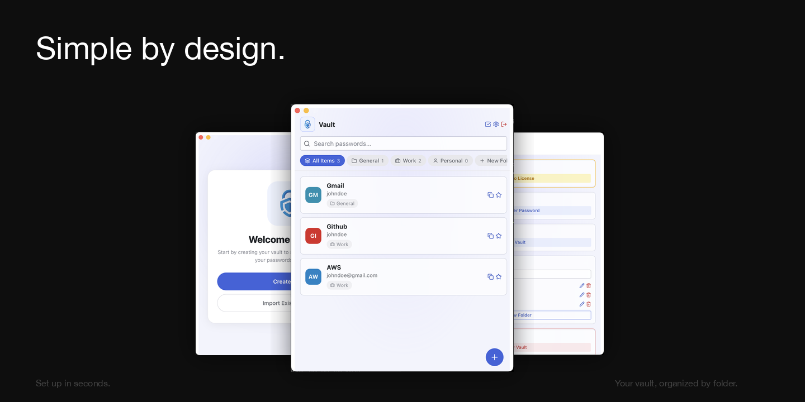

<div align="center">
  
  <h1>Vaultz</h1>

  [](LICENSE)
  
  [](coverage.json)

  **A password manager that doesn't phone home.**

  <a href="https://github.com/tinyforgestore/vaultz/releases/latest"></a>
  &nbsp;
  <a href="https://tinyforgestore.gumroad.com/l/vaultz"></a>

  <br />
  
</div>

---

## About

Vaultz stores your passwords locally — no cloud, no account, no subscription. Everything is encrypted with AES-256-GCM using a key derived from your master password; nothing ever leaves your machine. It runs natively on macOS, Windows, and Linux. One-time price, no recurring fees.

## Getting Started

**Prerequisites:** Node 20, pnpm 10, Rust stable, [Tauri prerequisites](https://tauri.app/start/prerequisites/)

```bash
pnpm install        # install dependencies
pnpm tauri dev      # run in development mode
pnpm tauri build    # build for production
```

## Open Core

The source code is released under GPLv3. Pre-built binaries are sold at $12 on Gumroad — buying a license supports continued development and unlocks unlimited entries.

## License

Distributed under GPLv3. See `LICENSE` for more information.

---

<div align="center">Vaultz by <a href="https://tinyforge.store">Tiny Forge</a> · tinyforge.store</div>
